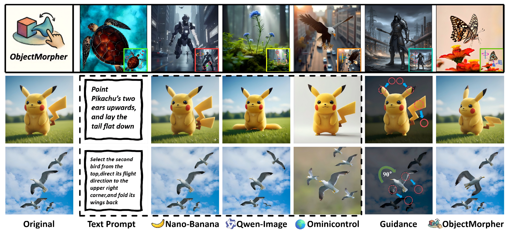

<h1 align="center">ObjectMorpher: 3D-Aware Image Editing via Deformable 3DGS (CVPR 2026)</h1>

<p align="center">
  
</p>

<p align="center">
  
</p>

<p align="center">
  <a href="https://panaoxuan.github.io/ObjectMorpher-web/">
    
  </a>
  <a href="https://arxiv.org/abs/2603.28152">
    
  </a>
  <a href="https://www.modelscope.cn/models/Xavianxxx/3DtoReal">
    
  </a>
</p>

This is the official repository for the CVPR 2026 paper: **ObjectMorpher: 3D-Aware Image Editing via Deformable 3DGS**.

Unlike purely 2D editing methods that often yield ambiguous or physically implausible results, **ObjectMorpher** converts 2D edits into geometry-grounded operations. Our framework lifts target instances into editable 3D Gaussian Splatting (3DGS), allows real-time physics-plausible non-rigid manipulation via As-Rigid-As-Possible (ARAP) constraints, and seamlessly blends the edited object back into the scene using a Generative Composition module.

## 🌟 Key Features

- 🚀 **Image-to-3D Lifting**: Accurately extract and reconstruct 2D instances into high-fidelity 3DGS representations.
- 🕹️ **Physics-Plausible Interactive Editing**: Real-time dragging with graph-based non-rigid deformation. We utilize geodesic distances (Floyd's algorithm) to prevent unnatural cross-part distortions.
- ✨ **Generative Composition**: A fine-tuned Qwen-Image-Edit LoRA module that harmonizes lighting, color, and boundaries for photorealistic reintegration.

## 🛠️ Environment Setup & Philosophy

**Important Note on Environments:** To prevent "Dependency Hell" between strictly-versioned CUDA 3DGS rasterizers and cutting-edge Diffusion/LLM frameworks (e.g., xformers, flash-attn), we have deliberately separated our pipeline into two distinct stages:

1. **Stage 1 (Local):** Interactive 3D Editing (SAM + TRELLIS + 3DGS ARAP).
2. **Stage 2 (Cloud / Local):** Generative Composition (Qwen-Image-Edit LoRA).

### Setting up Stage 1 (Interactive 3D Editing)

1. Clone the repository:

```bash
git clone --recursive https://github.com/panaoxuan/ObjectMorpher.git
cd ObjectMorpher
```

2. Create and activate the conda environment:

```bash
conda env create -f environment.yml
conda activate objectmorpher
```

3. Install pip dependencies:

```bash
pip install -r requirements.txt
```

## 🚀 Quick Start

### Stage 1: Local Interactive Editing

#### 1. Object Segmentation & Lifting

Select and extract target objects from the input image, then reconstruct the 3D model:

```bash
# Extract object using SAM
python -m preprocess.sam_processor -i inputs/image.jpg -o outputs/

# Reconstruct 3DGS via TRELLIS
python -m reconstruct_from_2d.app
```

#### 2. Interactive Gaussian Deformation (ARAP)

Launch our real-time interactive GUI. Drag control points to deform the object. The system uses geodesic constraints to maintain local rigidity.

```bash
python -m editing.edit_gui --gs_path reconstruct_from_2d/gs_ply/gaussian_model.ply
```

*(This step will output a rendered **Coarse Edit (CE)** image of your deformed object).*

#### 3. Background Preparation

Remove the original object from the scene and fill the occluded area:

```bash
python -m inpainting.infer_pixelhacker \
  --config inpainting/config/PixelHacker_sdvae_f8d4.yaml \
  --weight weight/ft_places/diffusion_pytorch_model.bin
```

### Stage 2: Generative Composition Refinement

To seamlessly harmonize the lighting, color, and boundaries of the Coarse Edit with the original image, we provide two options:

#### Option A: ModelScope Cloud (Highly Recommended)

For the fastest experience without heavy VRAM requirements or complex dependency setups:

1. Visit our hosted LoRA on ModelScope: [**ObjectMorpher Generative Composition Demo**](https://www.modelscope.cn/models/Xavianxxx/3DtoReal) *(replace with your actual link)*.
2. Upload your **Original Image** and the **Coarse Edit (CE)** generated from Stage 1.
3. Get the photorealistic final composition instantly.

#### Option B: Local DiffSynth-Studio (For Researchers)

If you wish to reproduce our quantitative results or run offline inference, we provide the training/inference scripts based on DiffSynth-Studio.

*(Detailed local setup instructions for the Qwen-Image-Edit LoRA will be released soon in the composition/ folder).*

## 📊 Results

### ObjectMorpher-Web Showcase

<p align="center">
  
</p>

<p align="center">
  <a href="materials/web/presentation.mp4"><b>▶ Watch Demo Video (MP4)</b></a>
</p>

## 📝 Citation

If you find our work or this codebase useful, please consider citing our CVPR paper:

```bibtex
@misc{xie2026objectmorpher3dawareimageediting,
      title={ObjectMorpher: 3D-Aware Image Editing via Deformable 3DGS Models}, 
      author={Yuhuan Xie and Aoxuan Pan and Yi-Hua Huang and Chirui Chang and Peng Dai and Xin Yu and Xiaojuan Qi},
      year={2026},
      eprint={2603.28152},
      archivePrefix={arXiv},
      primaryClass={cs.CV},
      url={https://arxiv.org/abs/2603.28152}, 
}
```

## 🙏 Acknowledgements

This project represents a systematic integration of several cutting-edge works. We stand on the shoulders of giants and express our profound gratitude to the open-source community:

- [**SC-GS**](https://github.com/CVMI-Lab/SC-GS): Our interactive UI and baseline 3DGS manipulation environment are heavily inspired by and built upon their excellent codebase. We extended its capabilities from dynamic scenes to single-image physics-plausible deformation.
- [**TRELLIS**](https://microsoft.github.io/TRELLIS/): For providing the robust and high-fidelity 2D-to-3D generation foundation.
- [**Segment Anything (SAM)**](https://github.com/facebookresearch/segment-anything) & [**PixelHacker**](https://github.com/PixelHacker): For powering our object extraction and background inpainting pipelines.
- [**DiffSynth-Studio**](https://github.com/modelscope/DiffSynth-Studio) & **Qwen-Image-Edit**: For the powerful foundation model framework that drives our generative composition module.